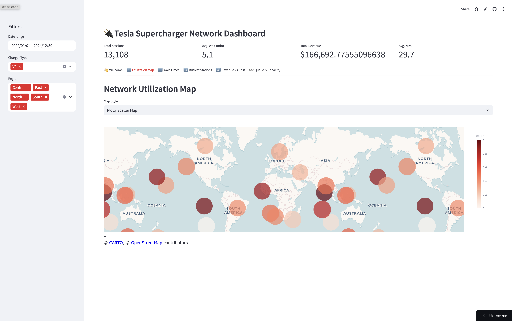
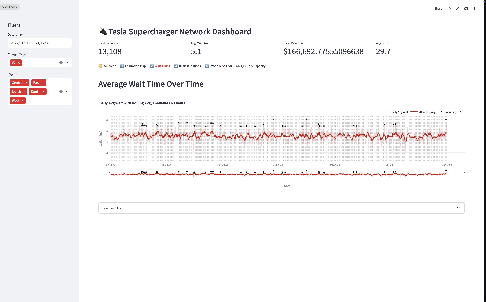
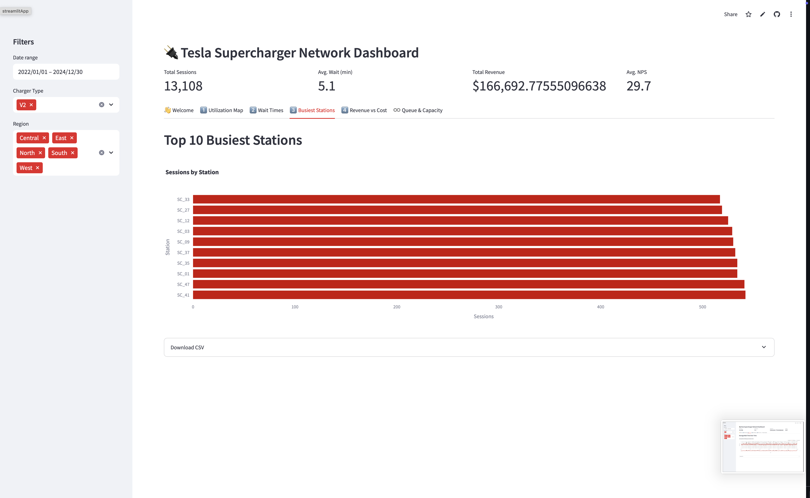
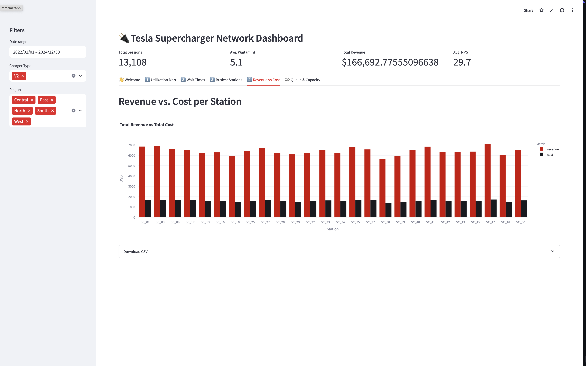
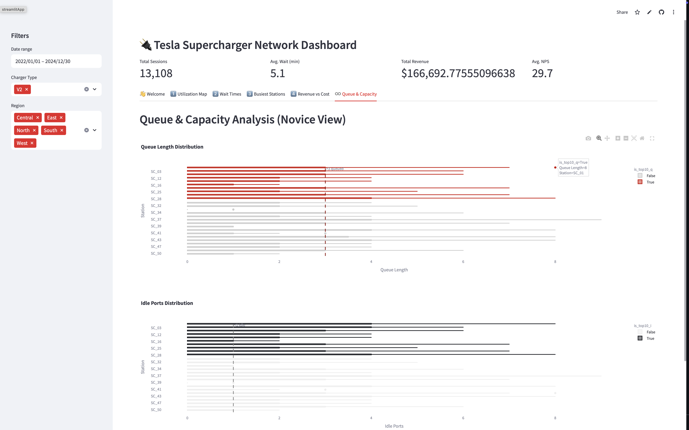

# 🚀 Tesla Supercharger Network Dashboard

**A comprehensive, interactive Streamlit application I built to turn raw charging data into actionable insights for Tesla’s Supercharger network.**

---

## 📖 Introduction

My goal with this dashboard is to equip Tesla management, regional planners, and operations teams with a single pane of glass to:

* Diagnose station hotspots and queue bottlenecks.
* Compare station-level profitability by juxtaposing revenue against operating costs.
* Prioritize network expansions to deliver the greatest wait‑time reduction and revenue uplift.

To power these analyses, I generated a realistic **three-year synthetic dataset**—including station metadata, hourly sessions, local weather, special events, and traffic volumes—so every chart reflects plausible, data‑driven operational dynamics. citeturn1file0

---

## 🏗 Dashboard Structure & Planning

I organized the app into **five main tabs**, each designed around a key business question:

1. **Utilization Map**: Geo-scatter or heatmap showing session counts and average wait times per station.
2. **Wait Times**: Interactive time-series of daily average wait times, 7-day rolling average, anomaly flags (>2σ), and event markers.
3. **Busiest Stations**: Horizontal bar chart ranking the top 10 stations by session volume.
4. **Revenue vs. Cost**: Grouped bar chart comparing total revenue against operating cost for every station.
5. **Queue & Capacity**: Boxplots displaying queue length and idle port distribution across stations.

### Key Metrics

* **Utilization**: Session counts to highlight demand hotspots.
* **Average Wait Time**: Daily means to surface service bottlenecks.
* **Session Frequency**: Volume ranking to guide capacity and staffing decisions.
* **Profitability**: Station‑level comparison of revenue vs. operating cost.
* **Queue & Capacity**: Distributional insight into queues and idle ports.

### Visualization Rationale

* **Geo‑Scatter/Heatmap** for spatial demand and congestion patterns.
* **Line Charts** with range sliders for trend analysis and anomaly detection.
* **Bar Charts** for clear station rankings and financial comparisons.
* **Boxplots** to reveal outliers and median performance in queue metrics.

By structuring around these focused views, decision‑makers can rapidly pinpoint issues and opportunities.

---

## ⚙️ Features & Interactive Elements

* **Global Filters**: Date range picker, charger type (e.g., V2), and region multiselect update every tab dynamically.
* **Metric Cards**: At‑a‑glance summaries for total sessions, average wait time, total revenue, and average NPS.
* **Plotly Visuals**: High‑performance, interactive charts with hover info, zoom, and anomaly annotations.
* **CSV Export**: Download the underlying data from each tab for offline analysis.
* **Caching**: Parquet data is loaded into pandas DataFrames and cached to ensure snappy performance.

---

## 📸 Screenshots & Insights

### 1. Utilization Map



> **Insight:** North America and Europe emerge as utilization hotspots—ideal candidates for incremental charger deployments.

### 2. Wait Times Over Time



> **Insight:** While the overall average hovers around 5 min, anomaly flags highlight intermittent demand surges, suggesting targeted staffing or maintenance reviews.

### 3. Top 10 Busiest Stations



> **Insight:** SC\_33, SC\_27, and SC\_12 lead usage. Prioritizing capacity upgrades at these sites will yield immediate impact.

### 4. Revenue vs. Cost per Station



> **Insight:** Profit margins vary: SC\_47 and SC\_03 show exceptional ROI, offering a blueprint for improving under‑performers.

### 5. Queue & Capacity Analysis



> **Insight:** Stations with the longest queues often have the fewest idle ports—dynamic port rebalancing could reduce wait times significantly.

---

## 🛠️ Installation & Setup

1. **Clone the repo**

   ```bash
   git clone https://github.com/yourusername/tesla-supercharger-dashboard.git
   cd tesla-supercharger-dashboard
   ```
2. **Install dependencies**

   ```bash
   pip install -r requirements.txt
   ```
3. **Place the data**

   * Ensure `tesla_supercharger_data.parquet` lives in the project root.

---

## ▶️ Running the App

```bash
streamlit run app.py
```

Use the sidebar filters to tailor the analysis, and click through tabs to explore different performance angles.

---

## 🛣️ Next Steps & Roadmap

1. **Real‑Time Data Ingestion**: Hook into Tesla’s live Supercharger API for up‑to‑the‑minute metrics.
2. **Predictive Forecasting**: Use ML models to predict wait‑time spikes and demand surges.
3. **Automated Alerts**: Trigger notifications when queues exceed thresholds or idle capacity drops.
4. **Mobile & Dark Mode**: Enhance UI for mobile responsiveness and low‑light viewing.
5. **Advanced Cost Modeling**: Integrate energy pricing and maintenance schedules for dynamic profit simulations.
6. **Role‑Based Access**: Secure the dashboard and expose tailored views to different teams.

---

## 📜 License

I’ve released this project under the **MIT License**—feel free to adapt and extend! See [LICENSE](LICENSE) for full terms.
